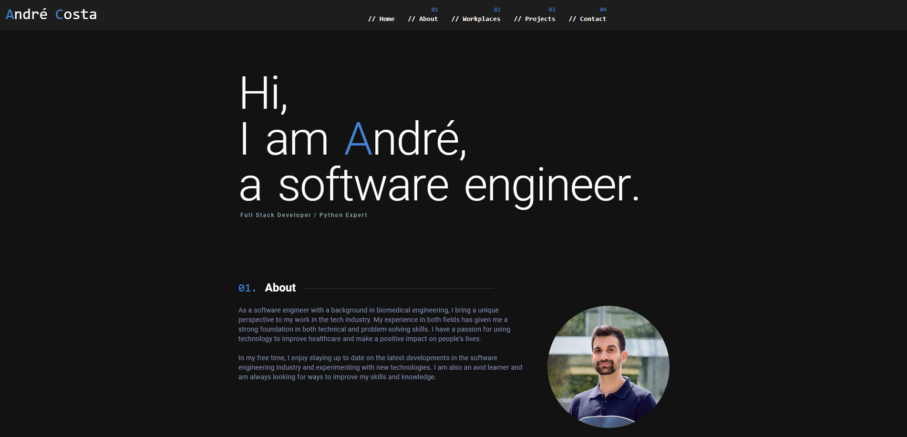

<div align="center">
  
  <h1>andrecosta.eu</h1>
  
</div>

---

This website was developed using:

- **Vue.js** for the frontend framework
- **TypeScript** for static type checking and improved development experience
- **Quasar** for the UI components and design

You can fork this repository, I just ask you to link back to [andrecosta.eu](https://andrecosta.eu)

Pallete customization can be made on `/css/quasar.variables.sass`

---

## Install the dependencies

```bash
yarn
# or
npm install
```

### Start the app in development mode (hot-code reloading, error reporting, etc.)

```bash
quasar dev
```

### Lint the files

```bash
yarn lint
# or
npm run lint
```

### Format the files

```bash
yarn format
# or
npm run format
```

### Build the app for production

```bash
quasar build
```

### Customize the configuration

See [Configuring quasar.config.js](https://v2.quasar.dev/quasar-cli-vite/quasar-config-js).
